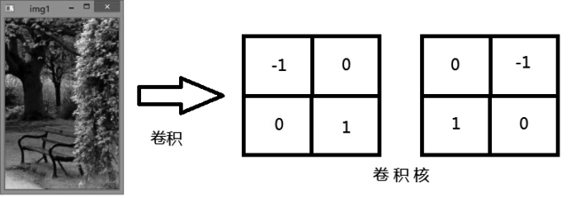
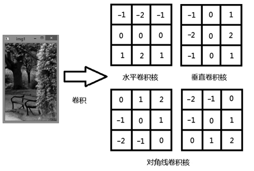
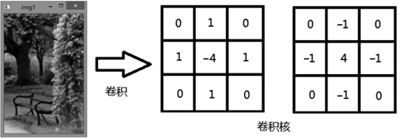

# ImageProcessingLab

图像处理学习  
OpenCV学习

**Fxx**

- [github](https://github.com/DR0006)
- [CSDN](https://blog.csdn.net/Fx_2003?type=blog)

----

## 目录

1. [内核](#内核)
2. [灰度化](#灰度化)
3. [二值化](#二值化)
4. [边缘检测](#边缘检测)
5. [腐蚀与膨胀](#腐蚀与膨胀)

-----

## 内核

图像处理是对每一个像素点进行运算，这些像素点的颜色值就是线性函数L的操作数，只有满足L(v)
=0的像素点才属于特定像素点的内核，可参加处理和运算。  
“内核”就是用来圈定计算某一个像素的新值所用到的其周围像素点的一个框（圆或者任意形状）。  
内核除了一个框外，另外还有一个值是其锚点，用来代表像素点在内核中的位置，通常在内核中心

## 灰度化

`gray`

## 二值化

```markdown
threshold()这个函数由4个参数共同作用来确定阈值完成二值化。

1. 第一个参数是原图；第二个参数是当前的阈值，即临界的阈值设定；
2. 第三个参数是最大阈值，在颜色方面，一般最大阈值为255；
3. 第四个参数是阈值计算类型，也就是阈值的具体计算方法。
4. 其中第四个参数提供的阈值计算类型有以下几种。
   第一种是THRESH_BINARY类型，BINARY表示二值化。如果像素值大于阈值，像素值就会被设置为某个值；如果小于等于阈值，则设置为0。
   第二种是THRESH_BINARY_INV类型，INV表示反转，意味着会将情况反转，也就是把THRESH_BINARY的情况反转，原来白的地方变黑，原来黑的地方变白。
   第三种是THRESH_TRUNC类型，TRUNC有截断的意思。就像园艺修剪一样，要求某处的草坪绿化保持一样的高度，树木也要朝着一个方向伸展，如果有露头的或者高出的，直接截断。
   第四种是THRESH_TOZERO类型，TOZERO有归零的意思。也就相当于小于某个阈值的时候，不会显示具体的灰度值，而是归零。
   相当于一份成绩统计单，小于60分的全部显示“不及格”或者“不通过”，不会显示具体的分数。这个思路跟THRESH_TRUNC的思路相反。
```

----

## 边缘检测

用离散化梯度逼近函数并根据二维灰度矩阵梯度向量来`寻找图像灰度矩阵的灰度跃变位置`，然后在图像中将这些位置的点连起来，就构成了所谓的图像边缘。

----

（1）*滤波*
：边缘检测的算法主要基于图像强度的一阶和二阶导数。导数通常对噪声很敏感，采用导数滤波器可以改善与噪声有关的边缘检测器的性能。  
常见的滤波方法主要有`高斯滤波`，即采用离散化的高斯函数产生一组归一化的高斯核，然后基于高斯核函数对图像灰度矩阵的每一点进行加权求和。

（2）*增强*：增强边缘的基础是确定图像各点邻域强度的变化值。  
增强算法可以将图像灰度点邻域强度值有显著变化的点凸显出来。具体实现可以通过计算梯度幅值来确定。

（3）*检测*：经过增强的图像，往往邻域中有很多点的梯度值比较大，而在特定的应用中，这些点并不是边缘点，所以应该采用某种方法来对这些点进行取舍。
常用的方法是通过`阈值化方法`来检测。

边缘检测大多数是通过基于方向导数掩码（梯度方向导数）求卷积的方法

- 比较常见的卷积算子有`Roberts算子`、`Sobel算子`等
- 常用的边缘检测算法有拉普拉斯算子与Canny算法变换。

----

### Roberts边缘检测

是图像矩阵与以下两个卷积核进行卷积，如图所示。  


-----

### Sobel算子

则是把卷积核替换成高斯卷积核，在图像的平滑处理上面，高斯平滑的效果比较好。用Sobel算子来处理边缘检测的问题也会给图像带来平滑处理。  


----

### Laplacian算子

即拉普拉斯算子  


--------

### Canny算子

Canny算法的实现步骤如下。

1. 对输入图像进行高斯平滑，降低错误率。  
   高斯滤波就是对整幅图像进行加权平均，每一个像素的值都是由其本身和邻域内的其他像素值经过加权平均后得到的。

2.
计算梯度幅度和方向来估计每一点处的边缘强度与方向。对于任何一点处的梯度，包括幅值和方向，用Soble卷积算子与对应像素点求卷积。  
对于边缘点的梯度，如果不做边缘补充，则把其周围的像素点默认为0。

3. 根据梯度方向，对梯度幅值进行非极大值抑制。本质上是对Sobel算子结果的进一步细化。

4. 用双阈值处理和连接边缘。对于双阈值，Canny算法根据图像选取合适的高阈值和低阈值，通常高阈值是低阈值的2到3倍。  
   如果某一像素的梯度值高于高阈值，则保留；如果某一像素的梯度值低于低阈值，则舍弃。  
   如果某一像素的梯度值介于高低阈值之间，则从该像素的8邻域寻找像素梯度值，如果存在像素梯度值高于高阈值，则保留；如果没有，则舍弃。

-------

`其实图像的边缘检测往往就是与某一个算子进行卷积，最终就会得到边缘检测的结果`

## 腐蚀与膨胀