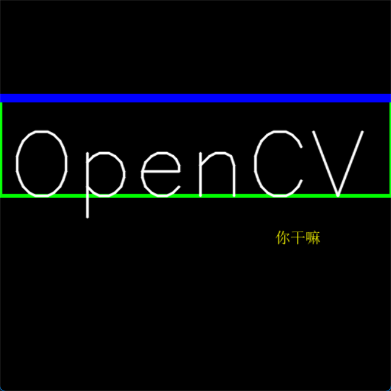
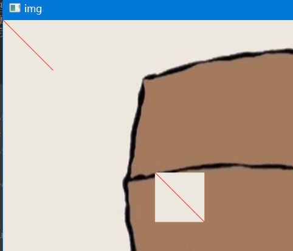
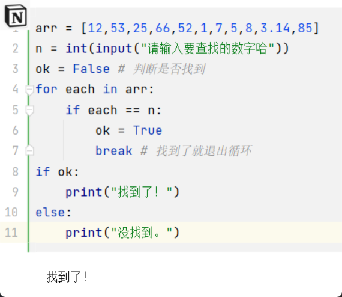
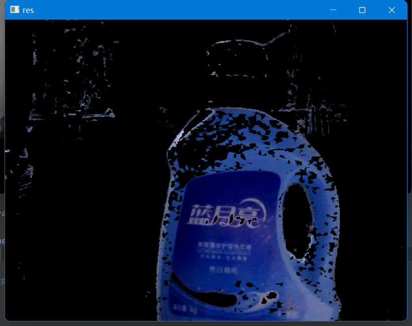
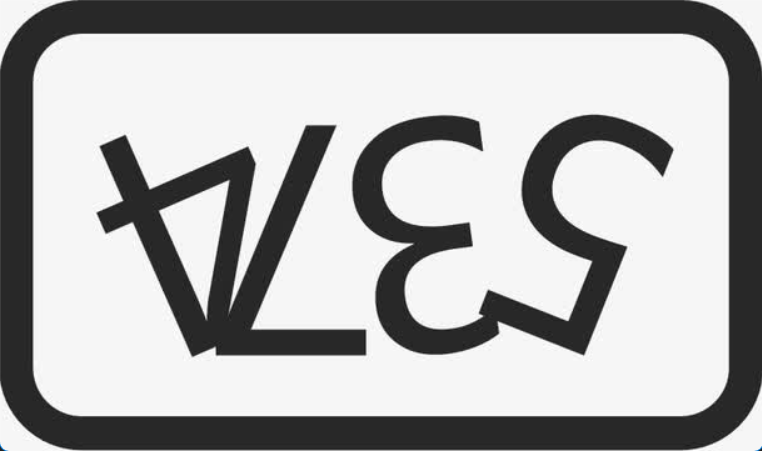
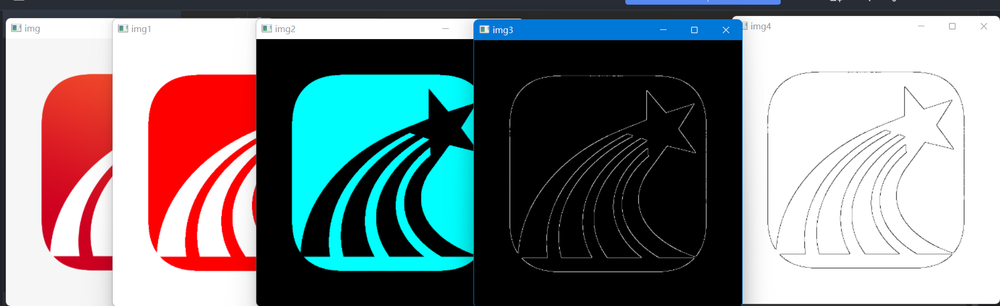
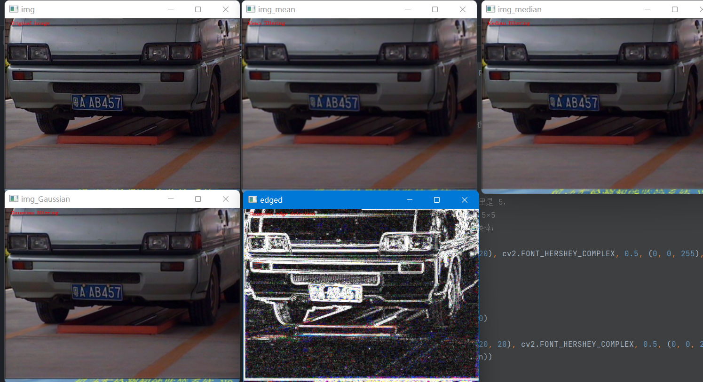
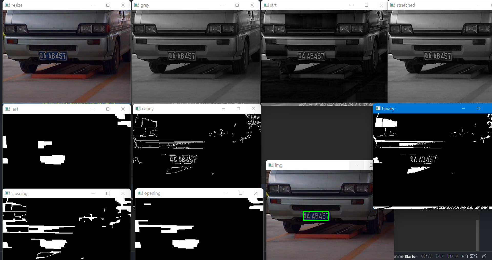

# ImageProcessingLab

图像处理课程的学习，主要用到OpenCV处理图像

---

`CV官方中文文档:`[OpenCV](http://www.woshicver.com/)

---

## 了解

1. [OpenCV的安装](#安装)
2. [读取图片展示视频](#熟悉和了解)
3. [绘图功能](#绘图)
4. [基操](#基操)
5. [运算](#运算)
6. [颜色空间](#颜色空间)
7. [图像几何变换](#图像几何变换)
8. [边缘提取](#边缘提取)
9. [图像滤波](#图像滤波)
10. [定位车牌位置，图像处理](#定位车牌位置)

## OpenCV

目录

### 安装

```bash
pip3 install opencv-python -i https://pypi.tuna.tsinghua.edu.cn/simple
#Successfully installed numpy-1.24.4 opencv-python-4.8.1.78
```

---

### 熟悉和了解

`Code:` [ipynb](./Code/读取图片展示视频.ipynb)

- 主要是图片的读取等操作，还有写入和摄像头调用及显示
- 视频文件的读取以及显示
- 里面写了一个等比例缩放的函数，因为有些图片太大不好显示

---

### 绘图

`Code:` [ipynb](./Code/绘图功能.ipynb)

- 举个简单的应用，比如说车牌识别，当你识别出结果后你就可以绘制到图片上
- cv.line()，cv.circle()，cv.rectangle()，cv.ellipse()，cv.putText()等
- 当你试图用putText绘制中文，出来的都是？？？？？
- 绘制中文 [ChineseText.py](tools/ChineseText.py)



### 基操

`Code` [ipynb](./Code/基操.ipynb)

- 访问像素值并修改它们
- 访问图像属性
- 设置感兴趣区域(ROI)
- 分割合并



### 运算

`Code`[ipynb](./Code/运算.ipynb)

- 学习图像的几种算术运算，例如加法，减法，按位运算等
- 图像融合cv.addWeighted()
- 按位运算

    


### 颜色空间

`Code`[ipynb](./Code/颜色空间.ipynb)

- 将图像从一个色彩空间转换到另一个，像BGR↔灰色，BGR↔HSV等
- 创建一个应用程序，以提取视频中的彩色对象



### 图像几何变换

`Code`[ipynb](./Code/图像几何变换.ipynb)

- 学习将不同的几何变换应用到图像上，如平移、旋转、仿射变换等
- 缩放



### 图像平滑

`Code`[ipynb](./Code/图像平滑.ipynb)

```markdown
blur = cv.GaussianBlur(img, (5, 5), 0) 高斯模糊
```

--------------------------------------------------------------------------------
--------------------------------------------------------------------------------

### 边缘提取

`Code`[ipynb](./CV-cv/1.ipynb)



### 图像滤波

`Code`[ipynb](./CV-cv/2.ipynb)



### 定位车牌位置

`Code`[test.py](./CV-cv/test.py)

  
